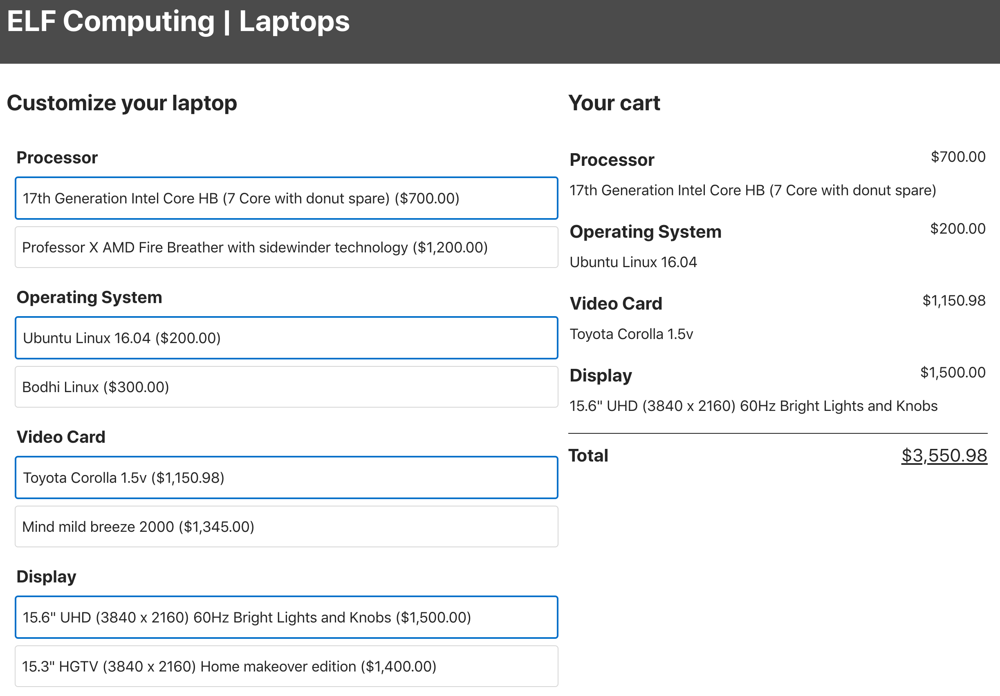

# bloc-react-12-14-assignment-elf

Assignment directions:

ELF Computers has hired you as a React developer. You've inherited some code for ELF's new order customization interface, and now it's your job to improve the code base.

Fork the existing code and clone it to your local machine. Navigate into the folder created and run these commands:

$ npm install
$ npm start
This will install the dependencies and start a development server for ELF's React app. You'll see this in your browser:

Screen shot of application

The app is already functional. It allows users to build a custom laptop from a series of options, and reports the total cost of the user's order. One problem: all the functionality has been built ito a single component! The single component has grown quite large and is doing too many different things. Unfortunately, apart from the source code, the previous developer provided little documentation.

Your task is to refactor this application using what you know about component-based organization. Note the following, however:

The style is not important. Try to keep everything looking the same; if you do break the styles, do not spend too much time trying to fix them. You can copy the existing CSS into new files for better organization, but you should not edit it.

The app works as intended; you only have to reorganize the code that is already there. This will require making new component files, but not much beyond that. If the app does not do something that you think it should, assume those changes can be made later.

Begin this task by breaking down the user interface into components and drawing them as a hierachal tree. You should be able to identify at least 6 components - possibly even more! Once you are satisfied with the component organization, take some time to plan out where the state(s) of the app will live. Finally, create the component files you will need, and move the existing code into those files.